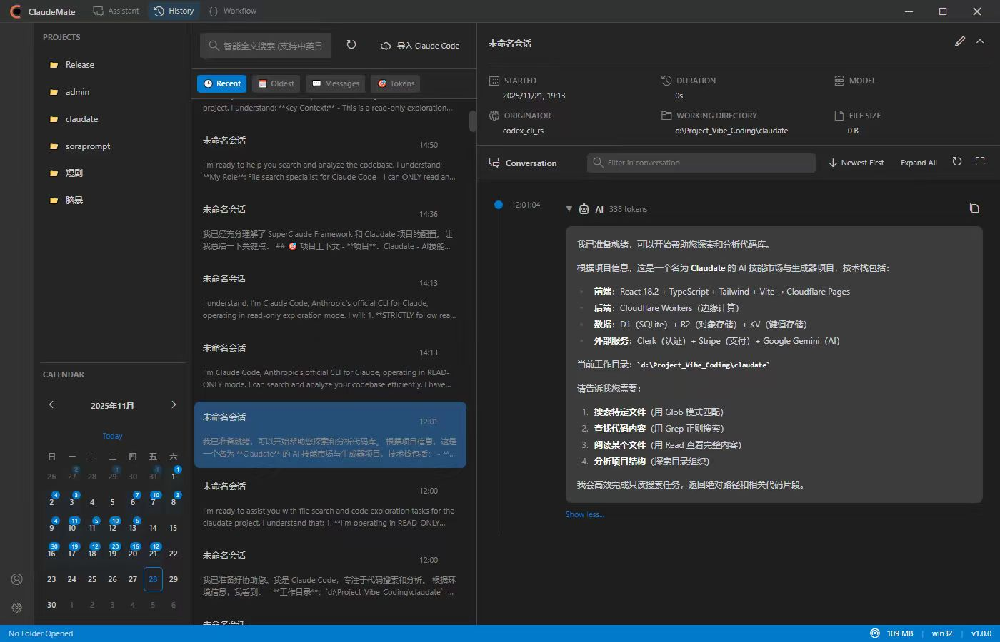

# ClautMate - AI 驱动的桌面助手

<div align="center">


使用 Electron、React 和 TypeScript 构建的生产级桌面应用，集成 Claude AI 提供智能辅助功能。

[English](./README.md) | 简体中文



[功能特性](#-功能特性) • [安装](#-安装) • [使用](#-使用) • [架构](#-架构) • [贡献](#-贡献)

</div>

---

## ✨ 功能特性

### 🤖 AI 助手集成
- **Claude AI 集成**：与 Anthropic 的 Claude Code CLI 无缝集成
- **智能对话**：与 AI 进行自然语言交流
- **代码理解**：AI 驱动的代码分析和建议
- **多语言支持**：支持中文、英文和日文分词

### 🎨 现代化 UI/UX
- **VSCode 风格界面**：熟悉且直观的设计
- **深色/浅色主题**：自动主题切换
- **响应式布局**：适配不同屏幕尺寸
- **自定义标题栏**：原生风格的无边框窗口

### 📁 项目管理
- **项目浏览器**：轻松的项目导航和管理
- **文件浏览器**：内置文件浏览器，支持搜索
- **聊天历史**：完整的对话历史记录，强大的搜索功能

### 🔒 安全与性能
- **沙箱渲染器**：安全的上下文隔离
- **内存管理**：自动监控和内存泄漏防护
- **类型安全**：完整的 TypeScript 覆盖，严格模式
- **优化构建**：代码分割和懒加载

---

## 🚀 安装

### 前置要求

- **Node.js** 18+ LTS ([下载](https://nodejs.org/))
- **Claude CLI**（可选，用于 AI 功能）- 安装方式：
  ```bash
  npm install -g @anthropic-ai/claude-code
  ```

### 快速开始

1. **克隆仓库**
   ```bash
   git clone https://github.com/yourusername/ClautMate.git
  cd ClautMate
   ```

2. **安装依赖**
   ```bash
   npm install
   ```

3. **启动开发服务器**
   ```bash
   npm run dev
   ```

4. **构建生产版本**
   ```bash
   npm run build
   npm run package
   ```

---

## 📖 使用

### 基本操作

**开始对话**
1. 点击导航栏中的 "Assistant"
2. 输入您的问题或请求
3. 按 Enter 或点击发送
4. 实时查看 AI 响应

**管理项目**
1. 导航到 "Projects" 标签页
2. 点击 "Add Project" 浏览项目文件夹
3. 从列表中选择并打开项目

**搜索历史**
1. 前往 "History" 标签页
2. 使用搜索栏查找过往对话
3. 按项目、日期或关键词筛选

### 配置

**Claude CLI 设置**（用于 AI 功能）

如果未检测到 Claude CLI：
1. 全局安装 Claude CLI：
   ```bash
   npm install -g @anthropic-ai/claude-code
   ```
2. 进行身份验证（会打开浏览器）：
   ```bash
   claude auth login
   ```
3. 重启应用程序

**主题切换**
- 应用会自动匹配系统主题
- 可在标题栏手动切换

---

## 🏗 架构

### 技术栈

- **前端**：React 18 + TypeScript
- **桌面框架**：Electron 28
- **构建工具**：Vite 5
- **状态管理**：Zustand + Immer
- **样式**：Tailwind CSS + VSCode 主题
- **数据库**：Better-SQLite3 + IndexedDB
- **AI 集成**：Claude Code CLI

### 项目结构

```
ClautMate/
├── src/
│   ├── main/              # Electron 主进程
│   │   ├── managers/      # 窗口和 IPC 管理器
│   │   ├── monitors/      # 性能监控
│   │   ├── services/      # 业务逻辑
│   │   └── utils/         # 工具函数
│   ├── renderer/          # React 前端
│   │   ├── modules/       # 功能模块
│   │   │   ├── Assistant/ # AI 聊天界面
│   │   │   ├── Projects/  # 项目管理
│   │   │   ├── FileExplorer/
│   │   │   └── ChatHistory/
│   │   ├── components/    # 可复用 UI 组件
│   │   ├── stores/        # 状态管理
│   │   └── hooks/         # 自定义 React Hooks
│   └── shared/            # 共享类型和工具
├── dist/                  # 构建输出
├── release/               # 打包的应用程序
└── docs/                  # 额外文档
```

### 核心原则

1. **类型安全**：完整的 TypeScript 覆盖，严格模式
2. **安全性**：上下文隔离的沙箱渲染器
3. **性能**：代码分割、懒加载、内存监控
4. **模块化**：清晰的关注点分离
5. **可扩展性**：易于添加新功能和模块

---

## 🔧 开发

### 可用脚本

```bash
# 开发
npm run dev              # 启动热重载开发服务器
npm run dev:vite         # 仅启动 Vite 开发服务器
npm run dev:electron     # 仅启动 Electron

# 构建
npm run build            # 构建生产版本
npm run build:vite       # 构建渲染进程
npm run build:electron   # 构建主进程
npm run package          # 打包成可执行文件

# 质量保证
npm run type-check       # TypeScript 类型检查
npm run lint             # ESLint 检查
npm run lint:fix         # 自动修复 lint 问题
npm test                 # 运行测试
```

### 添加新功能

#### 1. 创建新模块

```typescript
// src/renderer/modules/MyModule/index.tsx
import React from 'react';

export default function MyModule() {
  return (
    <div className="h-full flex flex-col">
      <h1>我的新模块</h1>
      {/* 您的 UI 代码 */}
    </div>
  );
}
```

#### 2. 添加路由

```typescript
// src/renderer/App.tsx
const MyModule = lazy(() => import('./modules/MyModule'));

<Route path="/my-module" element={<MyModule />} />
```

#### 3. 添加导航

```typescript
// src/renderer/components/layout/TitleBar.tsx
const navItems: NavItem[] = [
  // ... 现有项目
  {
    path: '/my-module',
    label: '我的模块',
    icon: 'codicon-symbol-module',
  },
];
```

---

## 🤝 贡献

欢迎贡献！请随时提交 Pull Request。

### 贡献指南

1. **Fork** 本仓库
2. **创建**功能分支 (`git checkout -b feature/AmazingFeature`)
3. **提交**更改 (`git commit -m 'Add some AmazingFeature'`)
4. **推送**到分支 (`git push origin feature/AmazingFeature`)
5. **打开** Pull Request

### 代码规范

- 所有新代码使用 TypeScript
- 遵循现有代码结构
- 为复杂逻辑添加适当注释
- 提交 PR 前确保所有测试通过

---

## 📝 许可证

本项目采用 GPL3.0 许可证 - 详见 [LICENSE](LICENSE) 文件。

---

## 🙏 致谢

- **Anthropic** - Claude AI 集成
- **Electron** - 桌面框架
- **React** - UI 框架
- **VSCode** - UI/UX 设计灵感

---

## 📧 联系与支持

- **问题反馈**：[GitHub Issues](https://github.com/yourusername/ClautMate/issues)
- **讨论交流**：[GitHub Discussions](https://github.com/yourusername/ClautMate/discussions)

<div align="left">
  <p><strong>加入微信交流群：</strong></p>
  
</div>

---

<div align="center">

**用 ❤️ 构建，基于 Electron + React + TypeScript**

[⬆ 返回顶部](#clautmate---ai-驱动的桌面助手)

</div>
